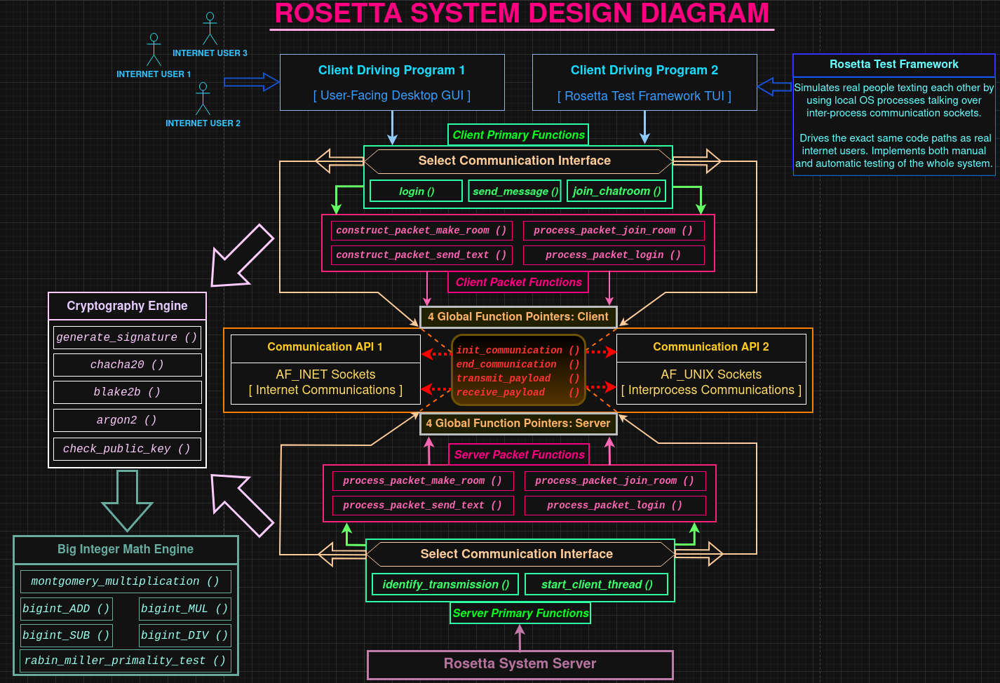

# Rosetta Secret Communications

```
Overview
--------

A hobby solo project where I've created a system for secret communications fully
from scratch in ≈ 10,000 lines of C code. The cryptography algorithms, the Big
Integer math engine they use, the communications server and client using a
custom payload protocol, and GUI + TUI user interfaces were all written by me,
with my own brain and two hands, without vibe coding or AI-generated code. LLMs
have in fact saved me time though, e.g. as info dumps and giving me new ideas.

An abstract communication interface consisting of function pointers allows
easily swapping underlying physical methods of communication, giving the system
potential to be used in a variety of ways.

A Test Framework I wrote in C simulates real human users via local OS processes
talking over local Unix interprocess communication sockets, allowing for easy
system-wide testing that drives the exact same code paths a normal human user
would, without dealing with issues like IP addresses, firewall rules, etc.
For real user-facing operation, the server currently runs on an AWS machine.

wxWidgets was used to implement a cross-platform C++ graphical user interface.

The system uses Diffie-Hellman shared secrets with 3072-bit prime modulus M and
320-bit prime factor Q exactly dividing (M - 1) that I discovered on my own,
using my Big Integer math engine - bigint.h.

Schnorr signatures are computed on each transmitted message, assuring your
friends that your message really was sent by you, was in fact relayed by the
legitimate system server and that an adversary didn't alter your message.

For internet communications, the server prevents even your Internet Service
Provider from finding out who you're talking to, as each client's network
traffic (with target IP addresses visible to their ISP) goes to the server, to
be relayed to all other clients a given user is currently in a chat room with.

A secret key protected by a password, via the Argon2id algorithm, keeps every
user's locally saved cryptographic artifacts, like their private key, encrypted.

Project status
--------------

The project is functionally complete and the system works well in its current
state. Final polishing & technical review efforts remain to be completed. A few
obscure, minimal security details unlikely to ever cause trouble remain. Future
low-level CPU performance analysis efforts are already planned.

Project components
------------------

A list of algorithms I've implemented in C:

Unsigned Big Integer limb-wise Add, Subtract, Multiply, Divide, Rabin-Miller
Primality Test, Montgomery Modular Multiplication. For cryptography - Argon2id,
chacha20, Blake2b, Diffie-Hellman shared secret generation, Schnorr signature
generation & validation, new Diffie-Hellman parameter discovery.

These algorithms are only 1/3 of the system though, the rest includes the custom
payload protocol, logic that acts on user input, communication plumbing code,
the Test Framework and the wxWidgets GUI.

All in all, the major project components are:

BigInt math engine, cryptography library, relay server, multi-UI system client,
multi-interface communication machinery and the Test Framework.

Extra project output artifacts
------------------------------

A fascinating low-level CPU microarchitecture performance analysis experiment I
carried out - using code interleaving to boost instruction-level parallelism and
successfully speed up an already well optimized C function - has its write-up in
my separate Github repository for performance analyses, if you're interested.

```
